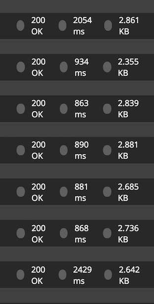
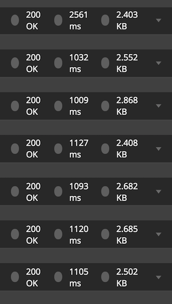
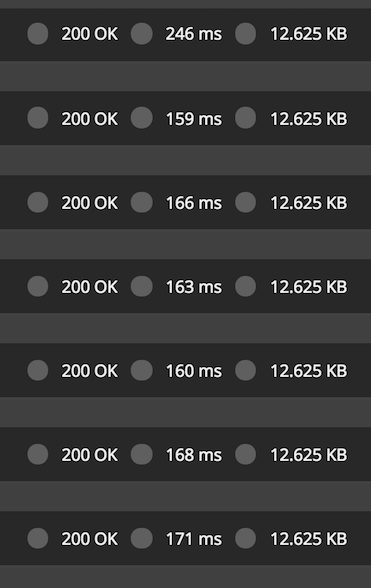

# 🎟 UNCMorfiServer with reservations 🎟
## Update 29/08
So this monday i've finished the server code then i upload this fork.  
Next day was the **critical test ?)**, check if it really works, **GUESS WHAT ?, it doesn't !** and it wasn't because the code, technically its fully functional, so what went wrong that day 🤔??  

#### First lets rewind to how it works:  
* `>> Client` calls `GET /reservation/login?code=...`
* `<< Server` call `GET comedor.unc.edu.ar/reserva`, and returns a `(path,token,captcha,cookies)` in Json as [**ReservationLogin**](https://github.com/joaqbarcena/UNCmorfiServer/blob/reservation/Sources/Application/Models/Reservations.swift)
* `>> Client` calls `POST /reservation/reserve` with a **ReservationLogin** with `captchaText` 
* `<< Server` calls `POST comedor.unc.edu.ar/reserva` with a `doLogin` action, *i.e.*  
First **commits a login**:  
 - **if it was successfull** -> does a `POST comedor.unc.edu.ar/reserva` with a `doProcess` action, scraps the page and returns the related status to scrapped result as [**ReservationStatus**](https://github.com/joaqbarcena/UNCmorfiServer/blob/reservation/Sources/Application/Models/Reservations.swift)
 - **else** -> This means that whatever reason that made it fail is potentially a wrong login information, so its sends a `.redoLogin` **ReservationStatus**  

So with the [**"Session Trick"**](https://github.com/joaqbarcena/givemeturno-ios#update--2208---344-jaja) we save to send the first request `GET /reservation/login?code=...` , but **`The server still doing 2 more requests (doLogin, doProcess)`** and that its fine but not so fine (would say **Guido**).
In the browser we can see that we can do the reservation while we are logged-in and at the profile page.  
But if we try to use the `Session Trick` doing the `doProcess` at first instead of `(doLogin, doProcess)` **it fails**

Here is where it comes the `ReservationLogin#path` and `ReservationLogin#token` when we are in *login*  pages of `comedor.unc.edu.ar` path ends with **3614** and token will be the same, when a `doLogin` its performed path ends with **3616** and token changes, but in subsequents requests will be the same, Which is the key on this ? is that `path` has a query param **`ah=`** that every time is called some action of `(doLogin, doProcess)` with **3616** (this means after login) **changes to a next valid** **ah=**

#### **TL;DR**
Now not only we save from `getLogin`, **from `doLogin` too !!**
But it's required that every call after `doLogin` returns a
`new path containing the new ` **`ah=`** `query param` to subsequent call, that's why ReservationStatus now has a :  
```swift
...
path:String? //Here returns every time the new path
token:String? //For first call only (doLogin, doProcess)
...
```

### Sad news 😭
Beside we achieve only run one request to `doProcess` after to do only one time `getLogin` and `doLogin`, **`TIMING`** is the real key on all of this, so the fact that an app sends request to an instance located in USA or Europe, that sends another request back to here in Argentina, it's like a lot of time

#### Comparisions:  

Heroku | AWS (EC2 - Debian 9) | Comedor UNC
------ | -------------------- | ----------- 
 |  |   

It's easy to see how a international server instance has response time of almost ~1 sec, when doing a request directly to the comedor server's takes only ~180ms (**`with 6 times more payload !!!!!!`**)

#### Last thoughts
What's next ? I've decided to make it work first on the server code, because so deep in me likes the idea that the server manages (with rest service) this API, and it's swift, so once i had this working
it willn't takes much effort port into [iOS App code](https://github.com/joaqbarcena/UNCmorfi) and run-it in remote or local mode

## Reservation fork's (also free heroku hosting 😎)
I'been working in parallel with givemeturn repos, where they were for research purpose, into this were wrote a correct implementation (or almost xd)

To test it i choose [heroku](http://heroku.com/) cloud, because its easy, simple and more over has a single instance free tier (without credit card and bla bla)!!!

## Some preliminaries
### Compilation (macOS)
To start the compilation in my case by some reason it has the mac sdk out of my 
actual version (10.13.6) High Sierra was with (10.10) Yosemite, so the server has some functions that needs 10.12 or higher, there are 2 ways to solve this issue `cli` or `xcode`

#### cli (specify target to compiler)
```bash
$ swift build -Xswiftc "-target" -Xswiftc "x86_64-apple-macosx10.13"
```

#### xcode (recomended if you will use it as main ide)
This will regenerate `xcode project` file for your installed version
```bash
$ swift package generate-xcodeproj
$ xed .
```
Then in xcode go to `UNCMorfiServer -> Deployment Target -> 10.13`
This will make you sure to not waste time

### Heroku deployment
Here after you get an account and have installed `heroku-cli` tool, then you can create the `instance` as follow by the [swift-buildpack](https://github.com/kylef/heroku-buildpack-swift), that's why i've moved from version 4.1 to 4.2 in `.swift-version`. The `Procfile` contains the cmd of the compiled binary that will execute heroku and the binded port `8080`.  
`Heroku` is based on git to do deployment, but that is better explained in heroku 

### Table of Contents
* [Requirements](#requirements)
* [Project contents](#project-contents)
* [Run](#run)
* [Configuration](#configuration)
* [License](#license)
* [Generator](#generator)

#### Project contents
This application has been generated with the following capabilities and services, which are described in full in their respective sections below:

* [CloudEnvironment](#configuration)
* [Embedded metrics dashboard](#embedded-metrics-dashboard)
* [Docker files](#docker-files)
* [Iterative Development](#iterative-development)

### Requirements
* [Swift 4](https://swift.org/download/)

### Run
To build and run the application:
1. `swift build`
1. `.build/debug/UNCmorfiServer`

#### Docker
A description of the files related to Docker can be found in the [Docker files](#docker-files) setion. To build the two docker images, run the following commands from the root directory of the project:
* `docker build -t myapp-run .`
* `docker build -t myapp-build -f Dockerfile-tools .`
You may customize the names of these images by specifying a different value after the `-t` option.

To compile the application using the tools docker image, run:
* `docker run -v $PWD:/swift-project -w /swift-project myapp-build /swift-utils/tools-utils.sh build release`

To run the application:
* `docker run -it -p 8080:8080 -v $PWD:/swift-project -w /swift-project myapp-run sh -c .build-ubuntu/release/UNCmorfiServer`

### Configuration
Your application configuration information for any services is stored in the `localdev-config.json` file in the `config` directory. This file is in the `.gitignore` to prevent sensitive information from being stored in git. The connection information for any configured services that you would like to access when running locally, such as username, password and hostname, is stored in this file.

The application uses the [CloudEnvironment package](https://github.com/IBM-Swift/CloudEnvironment) to read the connection and configuration information from the environment and this file. It uses `mappings.json`, found in the `config` directory, to communicate where the credentials can be found for each service.

If the application is running locally, it can connect to IBM Cloud services using unbound credentials read from this file. If you need to create unbound credentials you can do so from the IBM Cloud web console ([example](https://console.ng.bluemix.net/docs/services/Cloudant/tutorials/create_service.html#creating-a-service-instance)), or using the CloudFoundry CLI [`cf create-service-key` command](http://cli.cloudfoundry.org/en-US/cf/create-service-key.html).

When you push your application to IBM Cloud, these values are no longer used, instead the application automatically connects to bound services using environment variables.

#### Iterative Development
The `iterative-dev.sh` script is included in the root of the generated Swift project and allows for fast & easy iterations for the developer. Instead of stopping the running Kitura server to see new code changes, while the script is running, it will automatically detect changes in the project's **.swift** files and recompile the app accordingly.

To use iterative development:
* For native OS, execute the `./iterative-dev.sh` script from the root of the project.
* With docker, shell into the tools container mentioned above, and run the `./swift-project/iterative-dev.sh` script.  File system changes are detected using a low-tech infinitely looping poll mechanism, which works in both local OS/filesystem and across host OS->Docker container volume scenarios.

### Service descriptions
#### Embedded metrics dashboard
This application uses the [SwiftMetrics package](https://github.com/RuntimeTools/SwiftMetrics) to gather application and system metrics.

These metrics can be viewed in an embedded dashboard on `/swiftmetrics-dash`. The dashboard displays various system and application metrics, including CPU, memory usage, HTTP response metrics and more.
#### Docker files
The application includes the following files for Docker support:
* `.dockerignore`
* `Dockerfile`
* `Dockerfile-tools`

The `.dockerignore` file contains the files/directories that should not be included in the built docker image. By default this file contains the `Dockerfile` and `Dockerfile-tools`. It can be modified as required.

The `Dockerfile` defines the specification of the default docker image for running the application. This image can be used to run the application.

The `Dockerfile-tools` is a docker specification file similar to the `Dockerfile`, except it includes the tools required for compiling the application. This image can be used to compile the application.

Details on how to build the docker images, compile and run the application within the docker image can be found in the [Run section](#run).

### License
All generated content is available for use and modification under the permissive MIT License (see `LICENSE` file), with the exception of SwaggerUI which is licensed under an Apache-2.0 license (see `NOTICES.txt` file).

### Generator
This project was generated with [generator-swiftserver](https://github.com/IBM-Swift/generator-swiftserver) v5.4.2.
